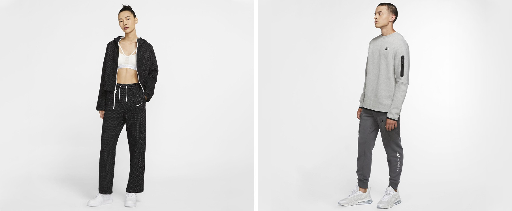

# 프론트엔드 10기 3조 | 나이키 클론


# 1. 프로젝트 소개

## 1-1. 맡은 사이트 : 나이키(Nike) 대한민국 버전의 사이트

- 기간: 2020.09.18 - 2020.09.25
- 팀원: 모선희, 정영신
- 나이키 사이트: 🏰  [**https://www.nike.com/kr/ko_kr**](https://www.nike.com/kr/ko_kr/)
- 프로젝트 사이트:  [https://0sin.github.io/Nike/](https://0sin.github.io/Nike/)


## 1-2. 협업툴

- 우리들의 **JANDI (잔디)**
- GitHub
- 발표자료 제작 Notion

## 1-3. 사용 언어

- HTML & CSS
- Library : font-awesome

# 2. Landing Page Issue

## 👉새로 알게된 것

## 2-1. **Font Awesome이란 웹 아이콘 폰트를 모아둔 라이브러리 사용**

 **+ i 태그**

🏛️ [**https://fontawesome.com/](https://fontawesome.com/) font awsome 웹 사이트 페이지**

대부분의 아이콘 폰트 서비스들은 CDN을 제공하고

스타일 시트 형태로 head부분에 위와같이 삽입하여

```html
<!--font-awesome cdn-->
<link href="https://cdnjs.cloudflare.com/ajax/libs/font-awesome/5.13.0/css/all.min.css"
      rel="stylesheet"/>
```

아래와 같이 아이콘 폰트를 특정 **클래스명으로 호출**하여 사용할 수 있습니다.

```html
<li>
	<a href="#">
			<i class="fa fa-shopping-cart" id="shopping-cart-desktop" aria-hidden="true"></i>
	</a>
</li>
```

(CDN)Content Delivery Network

특정 서버에 트래픽이 집중되지 않고 컨텐츠를 자동으로 가장 가까운 서버에서 다운받도록 하는 기술

CDN 방식 사용 ⇒ 직접 파일을 저장하지 않고 사용 가능

i 태그

일반적으로는 이탤릭에 사용된다고 하며 어떠한 이유로든 일반 텍스트에서 벗어난 텍스트의 의미

## ~~2-2. **css 속성을 이용하여 png 이미지 파일에 색상 변경하기**~~

```css
#cv_logo:hover {filter: opacity(.5) drop-shadow(0 0 0 #111);}
```

## 2-3. **video 태그에 playsline 속성은 무엇일까?**


스마트폰으로 웹사이트에 접속을 했을때 

해당 사이트에 있는 영상을 재생하려면 자동적으로 전체화면으로 전환되는데,

이때 전체화면으로 전환되지 않은채로

사이트내에서 그대로 재생할 수 있게 해주는 속성이 playsinline

**playsinline, muted, autoplay 3가지를 하나의 세트처럼 사용해야**

**인라인 재생(플레이어로 이동 또는 전체화면 모드로 넘어가지 않고)이 가능하다.**

```html
<video
            loop="loop"
            autoplay="autoplay"
            muted="muted"
            webkit-playsinline="webkit-playsinline"
            playsinline="playsinline"
            style="position: static"
          > 
            <source src="video/first_vid.mp4" />
          </video>
          <div class="content_text_wrap text_align_center">
```

## 2-4. web kit 을 사용하여 스크롤바에 CSS Style 주기

WebKit은 애플이 오픈소스로 개발하고 있는 **웹 렌더링 엔진**이고, HTML, CSS, JavaScript를 지원하도록 설계되었습니다. WebKit은 웹 애플리케이션을 개발하는 기업이 자체 개발을 해왔고, 대표적으로 Safari 브라우저, Chrome 브라우저(28 버전 이전), 안드로이드 기기용 브라우저 등에 WebKit 웹 렌더링 엔진을 사용해왔습니다.

출처:[https://12bme.tistory.com/208](https://12bme.tistory.com/208) [길은 가면, 뒤에 있다.]

"webkit 브라우저에서는 가상요소를 사용하여 스타일을 적용할 수 있다."

```css
.featured_shoes_wrap::-webkit-scrollbar-thumb:active {
  width: 328px;
  background: #111;
}
```

위 코드처럼 가상요소에 active 상태에 스타일을 주는것도 가능 

.클래스명 ::-webkit-가상요소 (scrollbar, scrollbar-thumb, scrollbar-track...)


## 2-5. CSS에서 hover 상태에 이미지 넣어 바꿔주는것도 가능하다


```css
#jd_logo {
   background: url(../img/icon/jd_logo_gray.png) no-repeat;
   background-size: 17px 16px;
   background-position: center center;
   height: 39px;
   width: 21px;
   cursor: pointer;
   padding: 0 20px;
 }
 #jd_logo:hover {
   background-image: url(../img/icon/jd_logo_red.png);
 }
```

## 2-6 CSS animation property 활용


두 상기 이미지가 교차로 계속 변화하는 부분은 CSS animation 속성을 사용하여 적용하였다.

```jsx
<div class="content_full_img_animation">
      
</div>
```

```jsx
.content_full_img_animation > img {
  width: 100%;
  opacity: 0;
  animation: img_opacity_change 4s ease 1s infinite;
}

.content_full_img_animation {
  background: url(../img/landing_content/05.content_2.jpg);
  background-size: 100%;
  width: 100%;
}

@keyframes img_opacity_change {
  0% {opacity: 0;}
  50% {opacity: 1;}
  100% {opacity: 0;}
}
```

background에 이미지를 넣고 기존 이미지에 opacity를 0으로 준 뒤 animation 속성을 주어 투명도를 변화시키는 방법으로 두 이미지가 교차하도록 하였다.

## 2-7 랜딩페이지 구현하며 어려웠던 부분


나이키 사이트의 스크롤 바는 전체영역을 차지하지 않고 **너비가 짧다.**

div 태그로 따로 스크롤바를 만들어 자바스크립트 요소로 너비를 조정한것이라

**오직 HTML과 CSS만으로 스크롤의 간격을 줄이기는 불가능하다.**

+

**전체 컨텐츠 너비를 동일하게 구현한 방법**

전체 페이지의 컨텐츠 넓이가 동일하고(=양 옆 마진이 같아서) 

섹션 하나에 너비를 정하고 

그 섹션에 모든 섹션을 다 넣는 방법이 괜찮은 방법인지..

**프로젝트를 하고나서 느낀점**

코드를 다시 짜고 고치는건 과거의 나와의 싸움이다..

# 3. NEW RELEASES  Page Issue

## 3-1. CSS position: sticky 활용

NEW RELEASES 페이지로 진입하면 Landing page의 <header> 아래에 '신상품 전체보기' header가 추가되며 스크롤 다운시  '신상품 전체보기' 글씨가 작아진다.

```jsx
<!-- Section Header -->
   <section id="section_header">
      <h1 class="section_header_title">신상품 전체보기</h1>
      <div class="section_header_button">
         <button>FILTER&nbsp;<i class="fas fa-sliders-h"></i></button>
         <div class="section_header_new"><a href="#">신상품순&nbsp;<i class="fas fa-angle-down"></i></a></div>
      </div>
   </section>

   <!-- Section Header Sticky-->
   <section id="section_header_sticky">
      <h1 class="section_header_title_sticky">신상품 전체보기</h1>
      <div class="section_header_button">
         <button>FILTER&nbsp;<i class="fas fa-sliders-h"></i></button>
         <div class="section_header_new"><a href="#">신상품순&nbsp;<i class="fas fa-angle-down"></i></a></div>
      </div>
   </section>
```

<section>을 2개로 나누어 id=section_header에는 position: absolute;를 주고 z-index: 9000; 값을,

 id=section_header_sticky에는 position: absolute;를 주고 z-index: 8000;으로 sticky section을 section_header 뒤에 오도록 배치 시킨 뒤 position: sticky; 속성을 주어 스크롤을 내릴 때 header가 따라오도록 작성하였다.

## 3-2. CSS display: flex 활용


Main Contents는 sidebar section과 contents_body section으로 나누었다.

section 양쪽은 모두 <ul>, <li> 태그로 정렬하였으며 body section에는 display: flex; 속성과 flex-wrap: wrap; 속성으로 <li>를 정렬하였다.

```jsx
<!-- Contents Body -->
      <section id="contents_body">
         <ul id="content_product_wrap">
            <li class="content_product">
               <div class="content_product_img">
                  <a href="">
                     
                  </a>
               </div>
               <div class="content_product_info">
                  <div>
                     <p class="color_brown_170">출시 예정</p>
                     <p>나이키 x T1 캡</p>
                     <p class="color_gray_141">성인공용 모자</p>
                     <div class="colors_change">2 컬러</div>
                  </div>
                  <div class="product_price">29,000원</div>
               </div>
            </li>
```

```jsx
#contents_body {
   width: 100%;
   margin: 143px 48px 0 0;
   position: relative;
   /* top: 150px; */
   display: flex;
   flex-wrap: wrap;
   box-sizing: content-box;
}

#content_product_wrap {
   display: block;
   margin: 0 -8px 0;
   font-size: 0;
}

.content_product {
   display: inline-block;
   width: 33.3333333333%;
   margin: 0 0 102px;
   padding: 0 8px;
   vertical-align: top;
   font-family: 'Noto Sans KR', serif;
   font-size: 16px;
   line-height: 25.6px;
   font-weight: 400;
}
```

단 이때 <li> 에 display: inline-block;과 width: 33.3333333333%; 속성을 주어 정렬하는 과정에서 각 <li> 요소 사이에 원치 않는 여백(약 4px)이 들어가는 문제가 발생하였다.

**해결방법은**

1. 부모 요소인 <ul>에  font-size: 0; 속성을 주어 해결하는 방법
2. <li> 요소에 margin-right: -4px;을 주어 해결하는 방법
3. 각 <li> 요소에 띄어쓰기나 엔터를 치지 않고 이어서 코딩하는 방법 (ex. <li>contents1</li><li>contents2</li><li>contents3</li>...)

등 세가지 방법이 주로 사용되며 3번은 가독성 측면에서 지양되므로 1번 방법을 사용하여 해결하였다.

## 3-3 NEW RELEASES 페이지 구현시 어려웠던 부분


사이드바를 구현하면서 각 타이틀을 클릭하면 아래로 리스트가 펼쳐지는 부분과

색상 라벨을 클릭 하였을 때 색상이 체크 되고 타이틀이 변하는 부분 등을 시간과 지식의 한계로 구현하지 못하고 마무리하게 된 점이 아쉬웠다.
